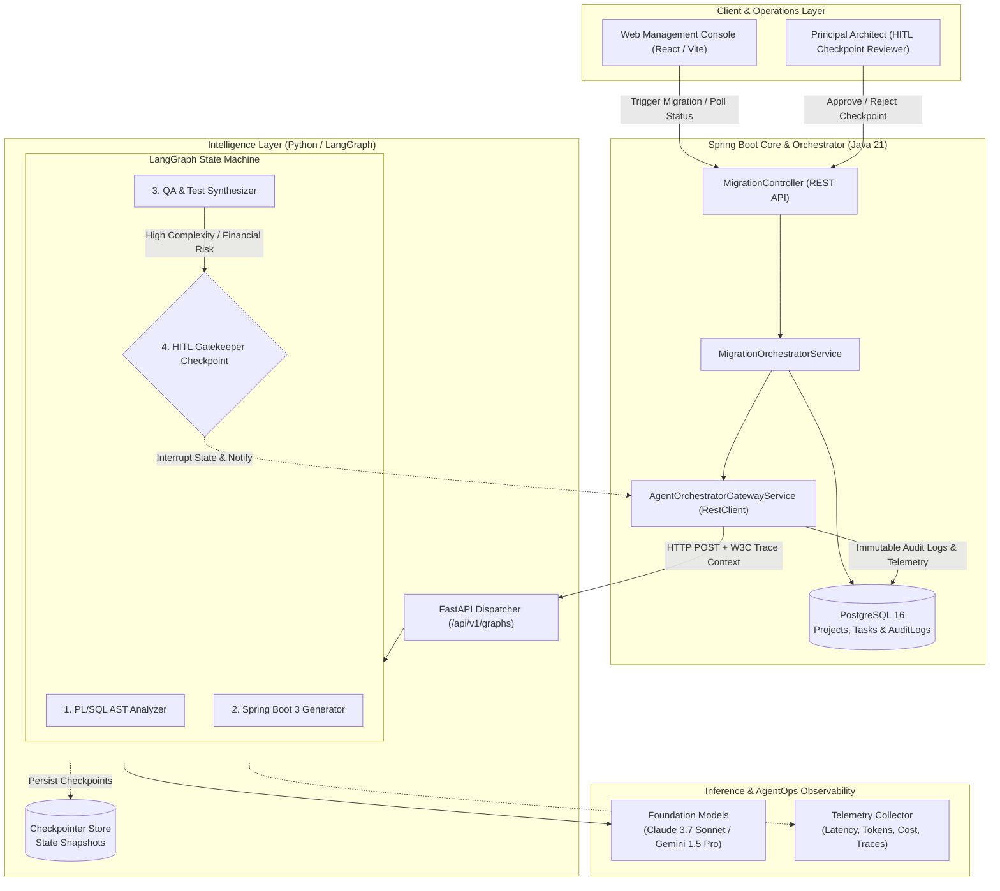

# Agentic-Migration-plataform

An enterprise-grade, hybrid platform designed for the autonomous modernization of legacy architectures (Oracle PL/SQL to Spring Boot 3 & Java 21 microservices). Powered by a Python/LangGraph multi-agent workflow engine and hardened with banking-grade **AgentOps** observability, state auditing, and Human-in-the-Loop (HITL) governance.

---

## 🏛️ High-Level Architecture

The platform follows a **Hexagonal Architecture (Ports & Adapters)** and **Domain-Driven Design (DDD)** pattern, decoupling transactional core business logic from agentic reasoning:



---

## 🔑 Core Capabilities

### 1. Backend Core & Orchestrator (Spring Boot 3.3+ / Java 21)
- **Hexagonal Architecture**: Clean separation between domain entities, ports, and external infrastructure adapters.
- **Resilient Gateway Service**: Built with Spring 6's fluent `RestClient`, supporting both blocking synchronous executions and non-blocking asynchronous workflows via dedicated thread pool executors (`ThreadPoolTaskExecutor`).
- **Distributed Tracing & Context Propagation**: Automatic injection of W3C `traceparent`, `X-Trace-ID`, and `X-Correlation-ID` across HTTP boundaries from SLF4J MDC.
- **Enterprise Persistence**: Spring Data JPA models with optimistic locking, indexing, and automatic auditing listeners (`@EntityListeners(AuditingEntityListener.class)`).

### 2. Agent Intelligence Layer (Python 3.11+ / LangGraph)
- **`plsql_analyzer`**: Extracts Abstract Syntax Trees (AST), schema dependencies, cursors, procedures, and embedded transactional constraints from legacy code.
- **`springboot_codegen`**: Synthesizes idiomatic Spring Boot 3.3 code (JPA entities, Spring Data repositories, transactional service layers, DTOs, and REST controllers).
- **`qa_validator`**: Auto-generates comprehensive JUnit 5 and Mockito regression test suites, assessing semantic equivalence and code complexity.
- **`hitl_gatekeeper`**: Deterministic checkpointing (`interrupt_before=["hitl_gatekeeper"]`). Freezes execution when critical banking rules or high-complexity thresholds are detected, requiring human architectural sign-off before merge.

### 3. AgentOps & Financial Compliance
- **Immutable Audit Trail (`AuditLog`)**: Detailed execution logging per node transition with SHA-256 state hashing for tamper-proof auditing and non-repudiation.
- **FinOps & Resource Metering**: Granular metrics tracking for prompt tokens, completion tokens, execution duration in milliseconds, and estimated USD model costs.
- **Recovery & Resumption**: Checkpointed states enable exact replay and resumption from failure or human-approval interruptions.

---

## 📁 Repository Structure

```text
.
├── backend-orchestrator/            # Spring Boot 3.3 / Java 21 Core Service
│   ├── pom.xml                      # Maven Build Descriptor
│   └── src/main/java/com/enterprise/agentops/
│       ├── OrchestratorApplication.java
│       ├── domain/                  # Pure Business Models, Enums & Repositories
│       │   ├── model/
│       │   │   ├── MigrationProject.java
│       │   │   ├── AgentTask.java
│       │   │   └── AuditLog.java
│       │   └── enums/
│       ├── application/             # Use Cases, DTOs & Port Interfaces
│       │   ├── dto/
│       │   └── port/out/AgentOrchestratorGateway.java
│       └── infrastructure/          # REST Adapters, RestClient & Config
│           ├── adapter/in/rest/MigrationController.java
│           ├── adapter/out/agent/AgentOrchestratorGatewayService.java
│           └── config/
├── agent-engine-python/             # LangGraph Multi-Agent Engine
│   ├── main.py                      # FastAPI Web Server
│   └── graph/migration_graph.py     # StateGraph Definition & Checkpoint Logic
├── contracts/                       # Strict JSON Schema API Specifications
│   └── schemas/
│       ├── legacy_migration_run_request.schema.json
│       └── legacy_migration_run_response.schema.json
└── README.md
```

---

## 📋 API Contract Specifications

JSON schemas located in [`contracts/schemas/`](file:///c:/Users/User/Documents/Engiennering/Agents-ops/contracts/schemas):

### Request Payload (`POST /api/v1/graphs/legacy-migration/run`)
```json
{
  "thread_id": "8f3e2b9c-7e28-4451-a8b6-78277c3b1711",
  "trace_id": "4bf92f3577b34da6a3ce929d0e0e4736",
  "span_id": "00f067aa0ba902b7",
  "agent_type": "PLSQL_CODE_ANALYZER",
  "phase": "DISCOVERY_AND_AST_ANALYSIS",
  "source_object_name": "PKG_ACCOUNT_BILLING.prc_close_month",
  "legacy_code": "CREATE OR REPLACE PACKAGE BODY PKG_ACCOUNT_BILLING ...",
  "context": {
    "target_database": "POSTGRESQL_16",
    "target_framework": "SPRING_BOOT_3"
  }
}
```

### Response Payload
```json
{
  "thread_id": "8f3e2b9c-7e28-4451-a8b6-78277c3b1711",
  "run_id": "b96e5d71-5913-4c91-9a72-74892c90c741",
  "checkpoint_id": "ckpt-8f3e2b9c",
  "generated_code": "// Spring Boot 3 Service & Repository Classes...",
  "analysis_summary": "Extracted 3 critical business rules; 2 database tables referenced.",
  "prompt_tokens": 4050,
  "completion_tokens": 1570,
  "total_tokens": 5620,
  "estimated_cost_usd": 0.0327,
  "requires_human_approval": true,
  "approval_message": "Approval required due to high financial criticality."
}
```

---

## 🚀 Quickstart Guide

### Prerequisites
- **Java 21 JDK** (e.g., Eclipse Temurin, GraalVM)
- **Maven 3.9+**
- **Python 3.11+**
- **PostgreSQL 15+**

---

### Step 1: Start the Python Agent Engine

1. Navigate to the agent directory and install dependencies:
   ```bash
   cd agent-engine-python
   pip install fastapi uvicorn langgraph langchain-core pydantic
   ```
2. Start the FastAPI server:
   ```bash
   uvicorn main:app --host 0.0.0.0 --port 8000 --reload
   ```
   The engine will be running at `http://localhost:8000` (OpenAPI docs at `http://localhost:8000/docs`).

---

### Step 2: Launch the Spring Boot Core Orchestrator

1. Configure your database connection in [`application.yml`](file:///c:/Users/User/Documents/Engiennering/Agents-ops/backend-orchestrator/src/main/resources/application.yml) or set environment variables:
   ```bash
   export DB_USERNAME=postgres
   export DB_PASSWORD=your_password
   export AGENT_ENGINE_URL=http://localhost:8000
   ```
2. Build and run the service:
   ```bash
   cd backend-orchestrator
   mvn clean spring-boot:run
   ```
   The orchestrator REST API will be accessible at `http://localhost:8080/api/v1`.

---

### Step 3: Trigger a Migration Task via REST

Submit a legacy PL/SQL code snippet for automated transformation:
```bash
curl -X POST http://localhost:8080/api/v1/migrations/units/dispatch-async \
  -H "Content-Type: application/json" \
  -d '{
    "projectId": "YOUR_PROJECT_UUID",
    "sourceObjectName": "PKG_LEDGER.prc_post_entry",
    "legacyPlSqlCode": "PROCEDURE prc_post_entry(...) BEGIN ... END;"
  }'
```

---

## 🛡️ Enterprise Security & Compliance

- **Distributed Traceability**: End-to-end W3C Trace Context linkage across Java and Python runtimes.
- **Cryptographic Hashing**: Inputs, outputs, and intermediate states are indexed with SHA-256 for non-repudiation.
- **Role-Based Checkpoints**: Sensitive transactional boundaries cannot be merged without explicit sign-off from authorized architects via `POST /migrations/tasks/{taskId}/approve`.

---

## 📄 License
This project is proprietary and confidential — engineered for mission-critical enterprise legacy transformation initiatives.
