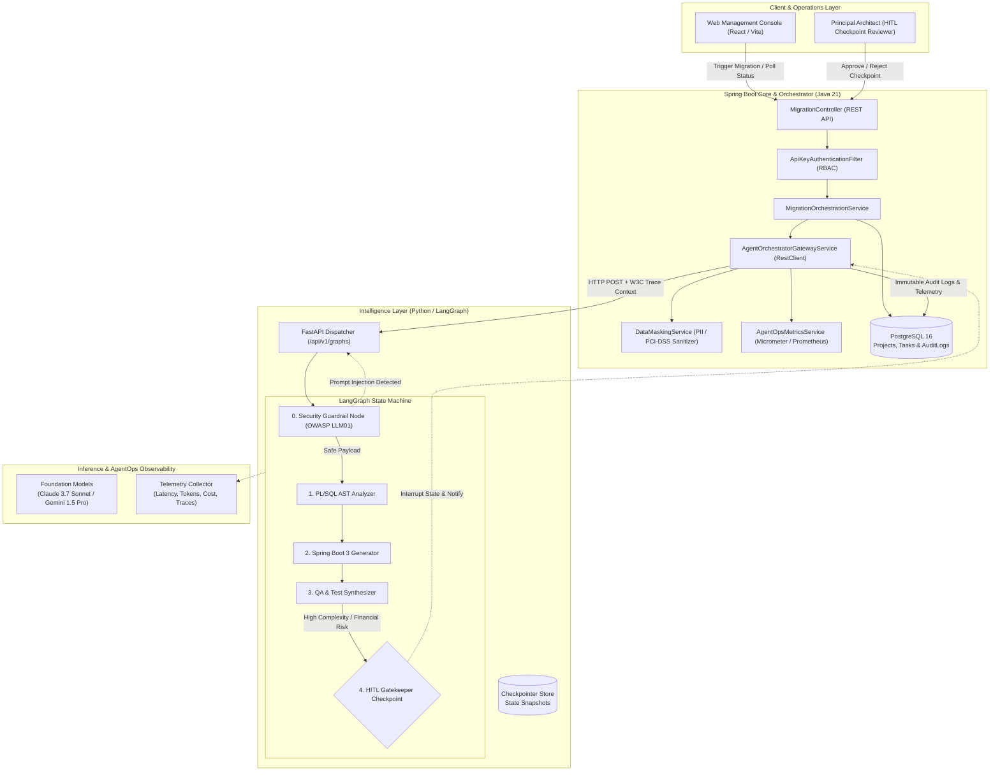

# Agentic-Migration-plataform

An enterprise-grade, hybrid platform designed for the autonomous modernization of mission-critical legacy architectures (Oracle PL/SQL to Spring Boot 3 & Java 21 microservices). Built with a decoupled Python/LangGraph multi-agent workflow engine and hardened with banking-grade **AgentOps** observability, cryptographic state non-repudiation, and Human-in-the-Loop (HITL) four-eyes governance.

---

## 🏛️ System Architecture & Engineering Standards

The platform follows a **Hexagonal Architecture (Ports & Adapters)** and **Domain-Driven Design (DDD)** pattern, decoupling transactional core business logic from agentic reasoning:



---

## 📚 Architectural Decision Records (ADRs)

Formal design documentation adhering to the MADR framework is maintained under [`architecture/adrs/`](file:///c:/Users/User/Documents/Engiennering/Agents-ops/architecture/adrs):

- [**ADR-001: Hybrid Spring Boot Core and Python LangGraph Decoupling**](file:///c:/Users/User/Documents/Engiennering/Agents-ops/architecture/adrs/ADR-001-hybrid-orchestration.md)
- [**ADR-002: Banking-Grade AgentOps, Observability, and Tamper-Evident Auditing**](file:///c:/Users/User/Documents/Engiennering/Agents-ops/architecture/adrs/ADR-002-agentops-auditability.md)
- [**ADR-003: Human-in-the-Loop (HITL) Checkpoints & Four-Eyes Governance**](file:///c:/Users/User/Documents/Engiennering/Agents-ops/architecture/adrs/ADR-003-human-in-the-loop-governance.md)
- [**ADR-004: Zero-Trust Cybersecurity, LLM Guardrails, and Data Protection**](file:///c:/Users/User/Documents/Engiennering/Agents-ops/architecture/adrs/ADR-004-cybersecurity-zero-trust-guardrails.md)

Detailed C4 diagrams (Context, Container, Component), Sequence flows, and STRIDE threat analysis are available in the [**Comprehensive System Design Document**](file:///c:/Users/User/Documents/Engiennering/Agents-ops/architecture/system-design/SYSTEM_DESIGN.md).

---

## 🛡️ Zero-Trust Cybersecurity & Compliance (Tier-1 Banking Grade)

1. **Role-Based Access Control (RBAC):**
   - Implemented via [`SecurityConfig.java`](file:///c:/Users/User/Documents/Engiennering/Agents-ops/backend-orchestrator/src/main/java/com/enterprise/agentops/infrastructure/config/SecurityConfig.java) and [`ApiKeyAuthenticationFilter.java`](file:///c:/Users/User/Documents/Engiennering/Agents-ops/backend-orchestrator/src/main/java/com/enterprise/agentops/infrastructure/security/ApiKeyAuthenticationFilter.java).
   - Enforces the **Four-Eyes Principle**: Only users with `ROLE_ARCHITECT` can approve HITL checkpoints (`/migrations/tasks/{id}/approve`). Operational batch dispatching is restricted to `ROLE_OPERATOR`.
2. **In-Flight PII / PCI-DSS Sanitization:**
   - Handled by [`DataMaskingService.java`](file:///c:/Users/User/Documents/Engiennering/Agents-ops/backend-orchestrator/src/main/java/com/enterprise/agentops/infrastructure/security/DataMaskingService.java).
   - Redacts primary account numbers (PAN), SSNs/Tax IDs, and embedded database connection credentials prior to logging and LLM dispatch.
3. **OWASP Top 10 for LLMs Guardrails:**
   - Implemented in [`guardrails.py`](file:///c:/Users/User/Documents/Engiennering/Agents-ops/agent-engine-python/security/guardrails.py).
   - Scans incoming code against direct/indirect prompt injections, jailbreaks, and malicious shell escapes (`dbms_scheduler`, `xp_cmdshell`).
4. **Cryptographic Non-Repudiation:**
   - Evaluates SHA-256 digests (`state_hash`) for incoming code and generated artifacts in [`agent_audit_logs`](file:///c:/Users/User/Documents/Engiennering/Agents-ops/backend-orchestrator/src/main/resources/db/migration/V1__init_enterprise_schema.sql).

---

## 🧪 Comprehensive Testing Pyramid

The project includes an exhaustive testing suite across the entire pyramid:

| Level | Test Suite | Description |
| :--- | :--- | :--- |
| **Unit** | [`DataMaskingServiceTest`](file:///c:/Users/User/Documents/Engiennering/Agents-ops/backend-orchestrator/src/test/java/com/enterprise/agentops/unit/DataMaskingServiceTest.java) | Validates PCI-DSS card masking and credential scrubbing. |
| **Unit** | [`AgentOrchestratorGatewayServiceTest`](file:///c:/Users/User/Documents/Engiennering/Agents-ops/backend-orchestrator/src/test/java/com/enterprise/agentops/unit/AgentOrchestratorGatewayServiceTest.java) | Tests `RestClient` invocation, MDC trace propagation, and token metrics. |
| **Unit / Pytest** | [`test_guardrails_and_graph.py`](file:///c:/Users/User/Documents/Engiennering/Agents-ops/agent-engine-python/tests/test_guardrails_and_graph.py) | Tests prompt injection neutralization and LangGraph execution. |
| **Functional** | [`MigrationControllerSecurityFunctionalTest`](file:///c:/Users/User/Documents/Engiennering/Agents-ops/backend-orchestrator/src/test/java/com/enterprise/agentops/functional/MigrationControllerSecurityFunctionalTest.java) | Verifies 403 Forbidden on unauthenticated calls and RBAC authorization barriers. |
| **Smoke** | [`OrchestratorSmokeTest`](file:///c:/Users/User/Documents/Engiennering/Agents-ops/backend-orchestrator/src/test/java/com/enterprise/agentops/smoke/OrchestratorSmokeTest.java) | Asserts Spring Context initialization and Actuator `/actuator/health` probe. |
| **End-to-End** | [`LegacyMigrationE2ETest`](file:///c:/Users/User/Documents/Engiennering/Agents-ops/backend-orchestrator/src/test/java/com/enterprise/agentops/e2e/LegacyMigrationE2ETest.java) | Full lifecycle: Dispatch -> HITL Interrupt -> Architect Sign-off -> Audit Validation. |

---

## 📁 Repository Layout

```text
.
├── architecture/
│   ├── adrs/                        # Formal Architectural Decision Records (MADR)
│   └── system-design/
│       └── SYSTEM_DESIGN.md         # C4 Diagrams, Sequence Flows, STRIDE Threat Model
├── backend-orchestrator/            # Spring Boot 3.3 / Java 21 Core Service
│   ├── Dockerfile                   # Hardened multi-stage container
│   ├── pom.xml
│   └── src/
│       ├── main/java/com/enterprise/agentops/
│       │   ├── domain/              # Entities, Value Objects & Repositories
│       │   ├── application/         # Usecases, DTOs & Outbound Ports
│       │   └── infrastructure/      # Controllers, RestClient, Security, Telemetry
│       ├── main/resources/
│       │   ├── application.yml
│       │   └── db/migration/        # PostgreSQL schema with audit indexes
│       └── test/                    # Full Testing Pyramid (Unit, Functional, Smoke, E2E)
├── agent-engine-python/             # LangGraph Multi-Agent Engine
│   ├── Dockerfile
│   ├── requirements.txt
│   ├── main.py                      # FastAPI Web Server
│   ├── graph/migration_graph.py     # StateGraph Definition & Checkpoint Logic
│   ├── security/guardrails.py       # OWASP LLM Defense & Input Sanitization
│   └── tests/                       # Pytest unit & functional suites
├── contracts/                       # Strict JSON Schema API Specifications
├── docker-compose.yml               # Local Multi-Service Orchestration
└── README.md
```

---

## 🚀 Quickstart via Docker Compose

Deploy the complete multi-tier platform (PostgreSQL 16, Python LangGraph Engine, and Spring Boot Core Orchestrator) in one command:

```bash
docker-compose up --build
```

- **Spring Boot Core API:** `http://localhost:8080/api/v1`
- **Actuator Health & Metrics:** `http://localhost:8080/api/v1/actuator/health`
- **FastAPI LangGraph Engine:** `http://localhost:8000/docs`
- **PostgreSQL 16 Database:** `localhost:5432/migration_orchestrator`

---

## 📄 License
Proprietary and Confidential — Engineered for Mission-Critical Enterprise Modernization Programs.
