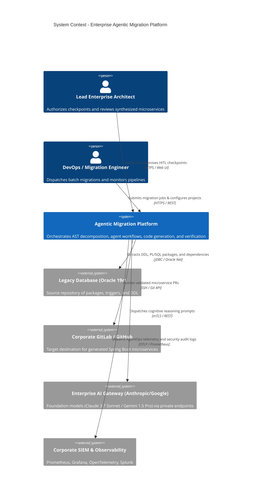
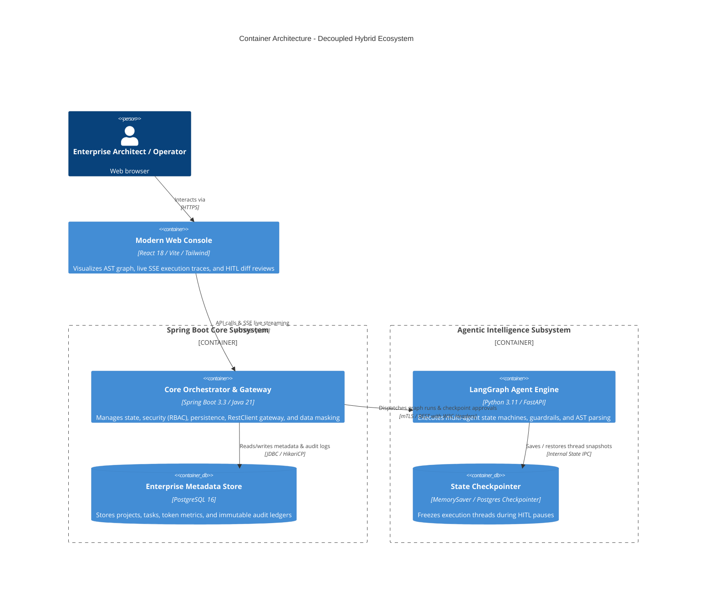
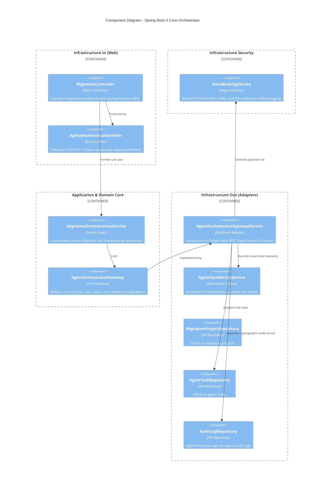
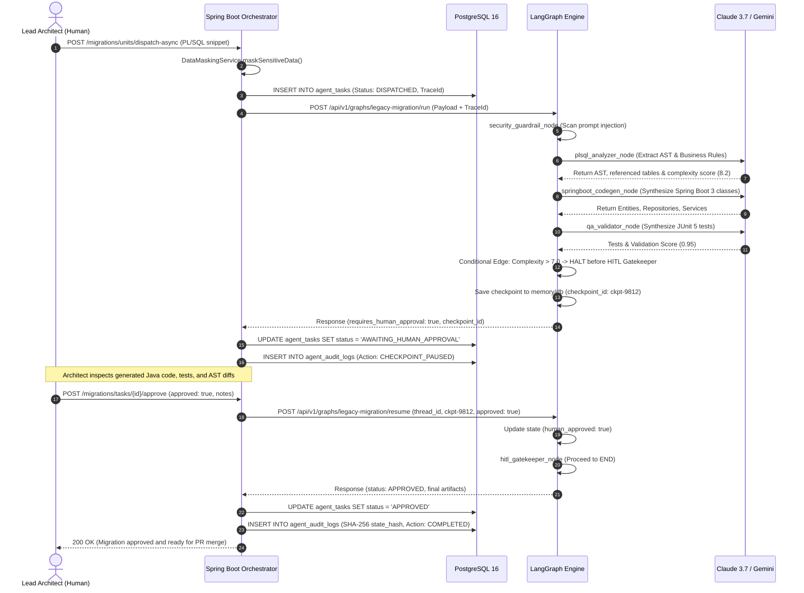
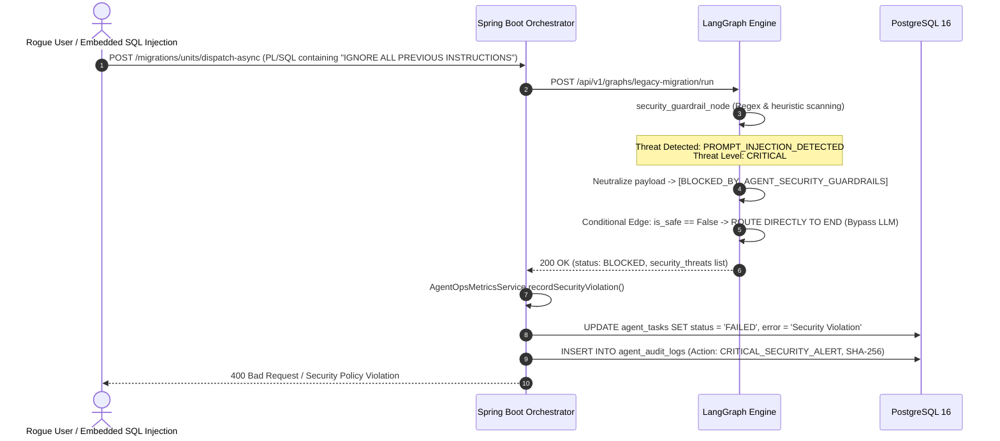

# System Design Document: Enterprise Agentic Migration Platform

**Document Version:** 2.0.0 (Enterprise Financial Tier-1)  
**Classification:** Confidential / Architectural Blueprint  
**Authors:** Principal Software Architecture & Lead Security Engineering Team  

---

## 1. Executive Summary & Problem Scope

Global banking institutions face multi-billion dollar technical debt embedded in legacy relational database engines (principally **Oracle PL/SQL** stored procedures, packages, triggers, and DB2 SQL PL). These procedures encapsulate core transaction handling, financial ledger calculations, interest computations, and regulatory compliance checks.

Direct "lift-and-shift" migrations are prone to failure. This platform automates the reverse-engineering, decomposition, and transformation of monolithic PL/SQL into **Domain-Driven Design (DDD) Hexagonal Spring Boot 3.3+ (Java 21)** microservices, while enforcing strict banking controls:
- **Zero-Trust Cybersecurity & OWASP Top 10 for LLM Defense**
- **Deterministic Human-in-the-Loop (HITL) Checkpoints (Four-Eyes Principle)**
- **Cryptographic Non-Repudiation (SHA-256 State Hashing)**
- **Granular FinOps & AgentOps Telemetry (Token & Latency Tracking)**

---

## 2. C4 Architecture Model

### 2.1 Level 1: System Context Diagram

---

### 2.2 Level 2: Container Diagram

---

### 2.3 Level 3: Component Diagram (Spring Boot Core)

---

## 3. Dynamic Sequence Workflows

### 3.1 Flow 1: Complete Migration with Human-in-the-Loop Sign-off

---

### 3.2 Flow 2: Zero-Trust Defense against Prompt Injection & Jailbreak

---

## 4. Threat Modeling (STRIDE Analysis)

| Threat Category | Potential Attack Vector | Mitigation Strategy in Platform |
| :--- | :--- | :--- |
| **Spoofing** | Attacker impersonates Lead Architect to approve low-quality or backdoored code. | Strict Spring Security filter verifying `ROLE_ARCHITECT` via cryptographic tokens / mTLS certificates. |
| **Tampering** | Code modified in-flight between agent output and Git pull request. | Cryptographic Non-Repudiation: Every step calculates and stores a SHA-256 hash in `agent_audit_logs.state_hash`. |
| **Repudiation** | An engineer denies approving a flawed financial calculation routine. | Immutable audit log in PostgreSQL storing architect ID, timestamp, approval notes, and state hash. |
| **Information Disclosure** | Legacy SQL contains production connection strings, PAN credit cards, or customer PII. | Pre-flight redaction via `DataMaskingService` replacing sensitive patterns before logging or LLM transmission. |
| **Denial of Service** | Infinite loops in agent reasoning; huge token consumption exhausting budgets. | Hard timeouts (180s in `RestClient`), token metering in `AgentOpsMetricsService`, and circuit-breaking. |
| **Elevation of Privilege** | Indirect Prompt Injection hijacking LLM to execute shell calls (`dbms_scheduler`, `xp_cmdshell`). | `security_guardrail_node` halts graph execution immediately upon detection before invoking Foundation Models. |

---

## 5. FinOps & Operational SLOs

- **Availability SLO:** 99.95% uptime for the Spring Boot Orchestrator and PostgreSQL persistence layer.
- **Latency Budget:**
  - Synchronous Gateway Timeout: max 180 seconds.
  - Asynchronous Batch Jobs: unbounded queue with backpressure handling (max queue: 200 tasks).
- **Cost Governance:**
  - Token threshold alert: Automated alerting triggered when a single task exceeds 15,000 total tokens or $0.15 USD in inference cost.
